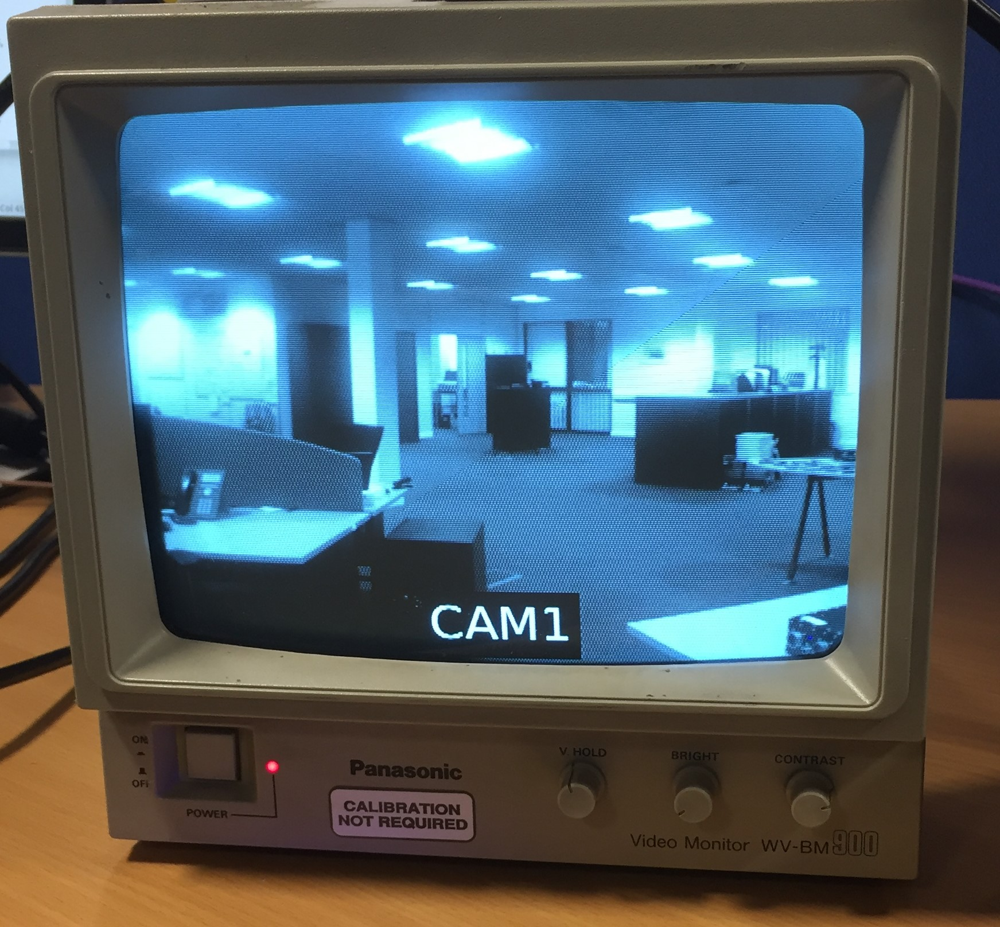

# ics8580-gstreamer1.0-plugin
Sink and source plugin for the Abaco Systems ICS-8580 board.

This plugin is tested under Gstreamer 1.2.4 in Ubuntu x64 14.04 LTS.
# Dependancies
On Ubuntu Linux the following dependancies are required to build the Gstreamer plugin:
## Hardware
Requires the ISC-8580 XMC card, reffer to manual for installation instructions.
## Software
Please install the ICS-8580 SDK Version 3.x required for complation of the plugin.

```
sudo apt-get install libgstreamer1.0-dev autoconf automake libtool
```
Before building export ICS8580_PATH to point to your ICS-8580 SDK install location.

*NOTE:* No need to run make-element (in tools dir) as this has already been done
# Building
Configure the build environment. Commands need to be done twice for both the sink and source plugins.
```
cd ./gst-plugin-[src|sink]/gst-plugin
./autogen.sh
```
# Installation
```
cd ./gst-plugin-[src|sink]/gst-plugin
./sudo make install
```
To verify the two plugins are installed use the gst-inspect command:
```
gst-inspect-1.0 8580[src|sink]
```
# Testing
You can invoke the plugin from the command line. This is the simplest way to create a pipeline. The two examples below show how you can stream video from the test source and scale video from a webcam (v4l2 driver). The only tested webcam was the Logitech C920.

To launch a pipeline:
```
gst-launch-1.0 -v videotestsrc pattern=0 horizontal-speed=1 ! "video/x-raw, width=640, height=480" ! 8580sink output=2 type=1 res=2 channel=1
gst-launch-1.0 -v v4l2src ! "video/x-raw, width=640, height=480" ! videoscale ! videoconvert ! "video/x-raw, width=720, height=576" ! 8580sink output=2 type=1 res=2 channel=1 sync=false
```

PAL (P26 on DAQMAG2A) output of black and white CRT (With text overlay).
# Known Issues / Todo
- [ ] PAL/NTSC input deinterlacing drops odd lines (very basic). Could do with improvement.
- [ ] PAL/NTSC output interlacing is macro defined in sink. Need to auto detect.
- [ ] Not all modes have been tested. Contact author for more information.
- [ ] Remove other absolute paths to ICS-8580 SDK.

# Links
* [Abaco Systems ICS-8580](https://www.abaco.com/products/ics-8580-video-compression-board)
* [Abaco Systems DAQMAG2A](https://www.abaco.com/products/daqmag2a-rugged-display-computer)


