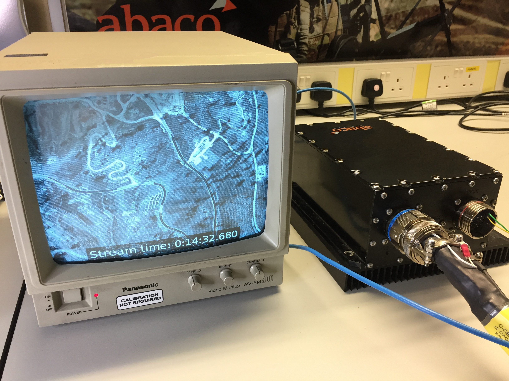

# ics8580-gstreamer1.0-plugin
Sink and source plugin for the Abaco Systems ICS-8580 board.

This plugin is tested under Gstreamer 1.2.4 in Ubuntu x64 14.04 LTS.
# Dependancies
On Ubuntu Linux the following dependancies are required to build the Gstreamer plugin:
## Hardware
Requires the ISC-8580 XMC card, reffer to manual for installation instructions.
## Software
Please install the ICS-8580 SDK Version 3.x required for complation of the plugin.

```
sudo apt-get install libgstreamer1.0-dev libgstreamer-plugins-base1.0-dev autoconf automake libtool git 
```
Before building export ICS8580_PATH to point to your ICS-8580 SDK install location.

*NOTE:* No need to run make-element (in tools dir) as this has already been done
# Building
Clone the depot to your machine and configure the build environment. Commands need to be done twice for both the sink and source plugins.
```
cd ./gst-plugin-[src|sink]/gst-plugin
./autogen.sh
```
# Installation
```
cd ./gst-plugin-[src|sink]/gst-plugin
./sudo make install
```
To verify the two plugins are installed use the gst-inspect command:
```
gst-inspect-1.0 8580[src|sink]
```
# Testing
You can invoke the plugin from the command line. This is the simplest way to create a pipeline. The two examples below show how you can stream video from the test source and scale video from a webcam (v4l2 driver). The only tested webcam was the Logitech C920.

To launch a pipeline example for sink:
```
gst-launch-1.0 -v videotestsrc pattern=0 horizontal-speed=1 ! "video/x-raw, width=640, height=480" ! 8580sink output=2 type=1 res=2 channel=1
```

## SRC
There are a number of gstreamer example scripts in the gst-plugin directory:
* test00-all-atonce.sh	- Test PAL inputs and HD-SDI at once. Display on screen.

## SINK
There are a number of gstreamer example scripts in the gst-plugin directory:
* test00.sh	- Simple test using a tes video pattern
* test01-tv.sh - Test the TV output using a V4L2 compatible webcam
* test02-rgb.sh	- Test VGA output
* test03-pngtv-roi.sh	- Test TV output extracting Region Of Interest (ROI) from an 8k image
* test04-pngtv-scale.sh	- Test TV output extracting Region Of Interest (ROI) from an 8k image
* test05-pngtv-stream.sh - Test TV output extracting Region Of Interest (ROI) from an 8k image and RTP stream over loopback interface (Stream conforms to GVA DEF-STAN 00-82).
* test06-desktoptv.sh - Test TV output of scaled Linux desktop


PAL (P26 on DAQMAG2A) output of black and white CRT (With text overlay).

# Ethernet jitter
If you experiance issues with streaming video over Ethernet then increase your maximum buffers and disable pause frames:
```
sysctl -w net.core.rmem_default=33554432
sysctl -w net.core.rmem_max=33554432
sysctl -w net.core.wmem_default=33554432
sysctl -w net.core.wmem_max=33554432

# Disable pause frame support
ethtool -A eth0 autoneg off rx off tx off
```
To execute this on startup you could place this in */etc/rc.local*
# Known Issues / Todo
- [ ] PAL/NTSC input deinterlacing drops odd lines (very basic). Could do with improvement.
- [x] PAL/NTSC output interlacing is macro defined in sink. Need to auto detect.
- [ ] Not all modes have been tested. Contact author for more information.
- [x] Remove other absolute paths to ICS-8580 SDK.

# Links
* [Abaco Systems ICS-8580](https://www.abaco.com/products/ics-8580-video-compression-board)
* [Abaco Systems DAQMAG2A](https://www.abaco.com/products/daqmag2a-rugged-display-computer)


